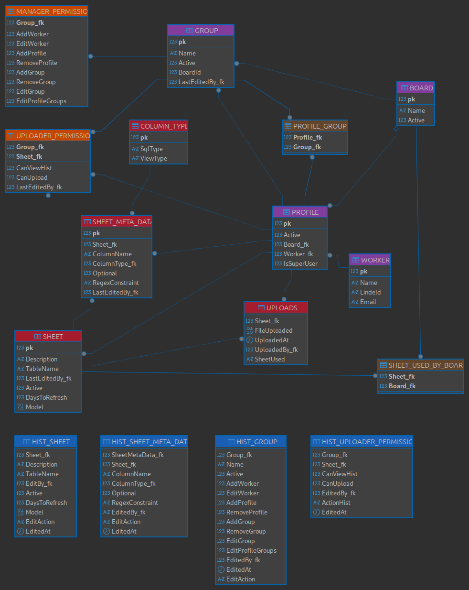

Mesmo com poucas tabelas base o esquema de banco de dados desse projeto pode parecer complexo. Mas no fundo, é bem mais simples do que parece. Esta documentação visa explicar como os dados desse projeto se relacionam, como os dados são armazenados e como podem ser utilizados por outros projetos.

O esquema do banco pode ser visualizado por completo na seguinte imagem:

# Relacionamento e armazenamento dos dados
Note que o esquema mostrado anteriormente é composto por blocos e linhas. Cada bloco corresponde a uma tabela do banco de dados, seu nome está posicionado na primeira fileira (colorida) enquanto que suas colunas são listadas nas fileiras seguintes. As linhas fazem ligações entre as tabelas (blocos), cada uma delas representa um correlação entre *primary key* e *foreign key*. Perceba que em uma das pontas das linhas tem um bolinha, ela indica a direção da correlação, a correlação entre as tabelas `WORKER` e "`PROFILE`" ocorre da seguinte maneira `MORKER.pk -> PROFILE.Worker_fk`.

Uma outra noção importante de ser destacada é a coloração das tabelas. Cada cor indica um sistema diferente tais sistema podem ser listados como:
|   Cor    |               Sistema                |
| :------: | :----------------------------------: |
|   Rosa   |      Gerenciamento de usuários       |
| Laranja  |     Gerenciamento de permissões      |
|  Marrom  |  Interface de correlação (auxiliar)  |
| Vermelho | Gerenciamento de modelos para upload |
|   Azul   |        Histórico de mudanças         |

Vale destacar que, até o devido momento, não existe uma forma de armazenar dados de tabelas. Tal metodologia será discutida nos [próximos tópicos](#armazenamento-de-dados).

## Gerenciamento de usuários
O sistema de gerenciamento de usuários é composto por 5 tabelas, 4 do sistema de gerenciamento de usuários e uma tabela auxiliar. A tabela que indica a existência de um usuário é a `WORKER`, sua restrição principal é que o campo LindeId deve ser único, restringindo então um Usuário por linha nessa tabela. 

Os usuários são divididos em sessões chamadas de `BOARD`, esse divisão existe para dar autonomia aos usuários de certas áreas, permitir um gerenciamento interno de permissões. Como um usuário pode atuar em múltiplas áreas ao mesmo tempo uma interface para a tabela `WORKER` foi implementada chamada de `PROFILE`, ela permite a criação de perfis distintos. Para ter quaisquer permissões no sistema um usuário deve possuir no mínimo um perfil, até mesmo *user users*, pois a partir dessa tabela que todo dado historio é gerado no sistema. Perfis não são aditivos, uma vez dentro da plicação um usuário com múltiplos perfis deve poder trocar livremente entre eles (cuidado com a troca de perfis dentro da UI do sistema, perfis possuem permissões diferentes).

Até então, nenhum usuário comum teria permissão a nada. Pela esquema demonstrado anteriormente, a interface entre os dados de permissionamento e os usuário é a tabela `GROUP` que são atreladas diretamente a tabela `BOARD`. Então, o grupo de permissionamento de cada `BOARD` é independente (cada `BOARD` possui sua própria listagem de grupos de permissionamento). Os grupos se relacionam com os perfis de usuários a partir da tabela auxiliar `PROFILE_GROUPS`, isso permite que cada usuário esteja inserido em diversos grupos ao mesmo tempo, permitindo um gerenciamento mais granular do sistema.

A lógica de usuários é bem simples então, todo sistema é dividido em sessões independentes na `BOARD`. Usuários são definidos na tabela `WORKER` e podem ser inseridos nas sessões através de perfis definidos na `PROFILE`, um usuário pode ter múltiplos perfis. As permissões são gerenciadas pela tabela `GROUP` e são dados a partir de uma interface com capacidade de inserir um usuário em múltiplos grupos localizada fisicamente na tabela `PROFILE_GROUPS`.

### Criação de um *super user*
Todo usuário normal deve ser listado uma vez na tabela `WORKER` e deve ter pelo menos uma instância na tabela `PROFILE` atrelada a um grupo na tabela `PROFILE_GROUPS` o que indica que o seu perfil deve ser atrelado a um sessão da tabela `BOARD`.

Já um *super user* não precisa de toda esse burocracia, ele deve ser listado uma vez na tabela `WORKER` e deve ter um perfil (na tabela `PROFILE`) com o campo `IsSuperUser` ativo, igual a 1. Tal perfil não pode ser atrelado uma sessão (tabela `BOARD`) visto que esse tipo de usuário tem acesso a tudo do sistema então semanticamente não faria sentido estar atrelado a uma sessão.

## Tabelas auxiliares
Essas tabelas fora criadas para evitar uma relação N para N de entidades. Todas elas funcionam como um tipo de listagem.

A tabela `PROFILE_GROUPS` faz a listagem de grupos (linhas na tabela `GROUP`) que um dados perfil (linha na tabela `PROFILE`) possui.

A tabela `SHEET_USED_BY_BOARD` faz a listagem de 

## Gerenciamento de permissões
O sistema de gerenciamento de permissões é compostos por apenas 2 tabelas, aquelas destacadas de laranja no esquema. Cada uma delas possui um funcionamento independente uma da outra. E elas se correlacionam diretamente com o sistema de usuários.

### `UPLOADER_PERMISSION`
Possui um funcionamento mais direto, ela indica se um grupo de usuário pode ou não visualizar o histórico de arquivos enviados e/ou fazer o *upload* de um novo arquivo. Como um usuário, membro da tabela `PROFILE` pode estar ligado a mais de um grupo ao mesmo tempo é de bom tom inferir que caso haja conflito no permissionamento de grupo o resultado deve ser aditivo. Se um `PROFILE` está ligado a dois grupos, onde o primeiro permite o *upload* da `SHEET` "1". Enquanto que, o segundo grupo, não permite o *upload* para o `SHEET` "1". O resultado final desse conflito deve ser a da permissão do *upload*, se um grupo permite, o usuário deve ter permissão.

### `MANAGER_PERMISSION`
Essa tabela é um pouco mais complicada, foi criada por conta da necessidade do autogerenciamento das áreas. Como cada área de negócio deve ter o seu próprio *key user* esse mesmo indivíduo, ou múltiplos deles, deve ser capaz de fazer o gerenciamento de diversos aspectos. As permissões fornecidas por essa tabela são restritas até o âmbito da tabela `BOARD`. Em outras palavras, um manager/admin de um determinado `BOARD` tem a capacidade de editar grande parte dos aspectos internos de um board, porém seu poder é reduzido quando tentam modificar tabelas como `PROFILE` e `WORKER`. Segue uma lista das possíveis permissões que um manager/admin pode ter:

**Atenção, *managers* só tem poderes sobre entidades que estão dentro de seu `BOARD` se um `GROUP` ou `PROFILE` está fora de seu domínio ele não pode ser editado/removido (adição impõe que a nova entidade esteja dentro de seu `BOARD`)**

- `WORKER`
  - Adição
    - Não pode criar `SuperUsers`
    - Uma vez que um novo `WORKER` for criado um novo `PROFILE`, do mesmo `BOARD` do criador do mesmo, deve ser criado
    - O campo `LindeId` é único, antes de criar um novo `WORKER` deve-se validar se ele já existe no banco
  - Edição restrita
    - Para os campo: `Name` e `LindeId`

- `PROFILE`
  - Adição
    - Apenas para o seu board
  - Remoção
    - Na verdade seria mais um *soft delete* uma vez que apenas o campo `Active` passaria a ser 0
    - O `PROFILE` em questão deve para de funcionar
    - Seus dados na tabela `PROFILE_GROUPS` deve ser limpo

- `GROUP`
  - Adição
    - Grupos criados por *managers* não podem ter permissões na tabela `MANAGER_PERMISSION`
      - Tal decisão foi imposta para impedir que diversas pessoas tenham acesso difuso a esse tipo de permissionamento
  - Remoção
    - Teria o mesmo funcionamento que a remoção de `PROFILE`, um *soft delete*
    - Grupos com permissionamento de manager não podem ser removidos por *managers*
  - Edição
    - Permite edição livre de permissões da tabela `UPLOADER_PERMISSION`
    - A tabela `MANAGER_PERMISSION` não podem ser alterada por *managers*

- `PROFILE_GROUPS`
  - Edição
    - *Managers* possuem livre permissão para editar essa tabela auxiliar
    - Adicionar um `PROFILE` a um `GRUPO` com permissões de *manager* não seria um problema
      - Uma vez que tal poder seria concentrado em poucos grupos

### Permissões de *Super users*
*Super users* são usuário especiais da ferramente, originalmente foram desenvolvidos para representar membros da digital, mas outros membros eventualmente podem ser adicionados. Esse tipo específico de usuário possui poder total na ferramenta, podendo adicionar, editar, remover (soft delete) tudo e quaisquer dado que seja possível de ser realizado na ferramenta. Seus dados da tabela `WORKER`, não precisam estar atrelados a tabelas como `PROFILE`, `BOARD` ou `GROUP`, eles possuem acesso total e irrestrito a todos os dados da ferramenta.

Com grandes poderes vem grandes responsabilidades, *super users* possuem responsabilidades que mais nenhum outro usuário possui e somente com o trabalho deles que a ferramenta pode se manter. Eles ão os responsáveis por fazer o gerenciamento dos `BOARD`s das permissões de admin/manager (`MANAGER_PERMISSION`) e a criação, edição, remoção e correlação de `SHEET`s no sistema. Devem estar constantemente de olho nas tabelas: `BOARD`, `MANAGER_PERMISSION`, `SHEET_USED_BY_BOARD`, `SHEET`, `SHEET_META_DATA`.

## Gerenciamento de modelos para upload
Esse sistema é o coração da ferramenta, nele que são definidos os tipos de planilhas e seus dados. Apenas *super users* podem interagir com esse sistema.

Nele tudo se inicia na tabela `SHEET`, uma nova linha nela indica que uma nova planilha de dados foi criada. No entanto, isso não indica que dados já podem ser consumidos/enviados, para tal a tabela `SHEET_META_DATA` deve ser populada.

Essa última tabela mencionada tem a função de guardar informações referentes as colunas de sua respectiva planilha. Ela pode guardar informações como o Nome da coluna (deve ser único por planilha, `ColumnName`), o tipo de dado da coluna (`ColumnType_fk`), se o dado é obrigatório ou opcional (`Optional`) e se necessário uma restrição de dados em formato RegEx (`RegexConstraint`). Note que a tabela `SHEET_META_DATA` pode sim ser editada, mas nem todas as operações de edição podem ser realizadas, assim como não é possível editar os dados de uma tabela populada livremente.

**Atenção: uma vez que uma coluna é adicionada a uma planilha ela não pode ser removida!**
OBS: poderia passar a ser opcional e o usuário que faz o upload não se preocupa em preenche-la

Para a tipagem dos dados das colunas, uma outra tabela foi implementada chamada de `COLUMN_TYPE`. Nela, defini-se apenas uma correlação entre tipagem do SQL (`SqlType`) e a descrição que será visualizada na UI do sistema (`ViewType`). Segue um exemplo de tipagem, usado na versão de teste da ferramenta:

Por fim, mas não menos importante, tem-se a tabela `UPLOADS`. Ela serve como nada mais nada menos do que um histórico de uploads, ela armazena o zip do arquivo que foi enviado (`FileUploaded`), quem o enviou (`UploadedBy_fk`), quando ele foi esse envio (`UploadedAt`) e para o caso de planilhas excel ou arquivos similares que podem possuir múltiplas "sheets" em seu interior, qual sheet foi utilizada (`SheetUsed`).

## Armazenamento de planilhas (**IMPORTANTE**)
Uma vez que uma nova sheet é criada, uma nova tabela é gerada no sistema, com as informações presentes nas tabelas `SHEET`, `SHEET_META_DATA` e `COLUMN_TYPE`. Toda vez que a tabela `SHEET_META_DATA` é editada a tabela que foi gerada deve mudar para refletir essas mudanças. Quando um usuário faz um *upload* de novos dados a tabela gerada deve ser populada, série de checks são feitos para validar se a planilha enviada está de acordo com o modelo definido.

OBS: a tabela `SHEET` possui um campo chamada de `Model` que pode ser populado com uma tabela modelo. Alterativamente, seria interessante se o sistema fosse capaz de gerar um arquivo modelo pelas informações das tabelas `SHEET` e `SHEET_META_DATA`.

## Armazenamento de histórico
As tabelas que possuem histórico atreladas a elas são:
|      Tabela mãe       |      Tabela histórico      |
| :-------------------: | :------------------------: |
|        `SHEET`        |        `HIST_SHEET`        |
|   `SHEET_META_DATA`   |   `HIST_SHEET_META_DATA`   |
| `UPLOADER_PERMISSION` | `HIST_UPLOADER_PERMISSION` |
|        `GROUP`        |        `HIST_GROUP`        |
| `MANAGER_PERMISSION`  |        `HIST_GROUP`        |

Todos os históricos são populados a partir de *triggers* inseridos dentro de cada tabela mãe. Note que a tabela `HIST_GROUP` é usada para duas tabelas ao mesmo tempo, isso está correto. 

**ATENÇÃO: antes atualizar a tabela `MANAGER_PERMISSION` a tabela `GROUP` deve ser atualizada com a informação do usuário (`pk` do `PROFILE`)**

Uma observação, o esquema do banco pode ter ficado meio confuso justamente pela lógica do histórico. Ela exige que cada tabela que tenha essa funcionalidade seja ligada a tabela `PROFILE` para manter o monitoramento das mudanças, por esse motivo que grande parte das tabelas possui a coluna `LastEditedBy`.

# Utilização dos dados
Os dados desse sistema foram idealizados para serem usados internamente. Porém, nada impede que outros processos criem referencias como views e processos para o consumo dos dados internos.

**ATENÇÃO: processos externos não devem editar os dados internos desse processo!!**

# Implementação
O script para criação do banco de dados se encontra nesse [arquivo](/docs/gen_db.sql). Caso algum erro de execução seja lançado tente executar o script da seguinte maneira:
1. Execute o script de criação do schema
2. Execute o script de criação das tabelas
3. Execute de um em um os scripts de criação dos triggers

Para inicializar a tabela `COLUMN_TYPE` com os valores iniciais use esse [arquivo](/docs/populate_COLUMN_TYPE.sql).

# Observações
O arquivo [".erd"](/docs/esquema_completo.erd) deve ser aberto junto a software de gerenciamento de banco de dados [DBeaver](https://dbeaver.io/download/)
